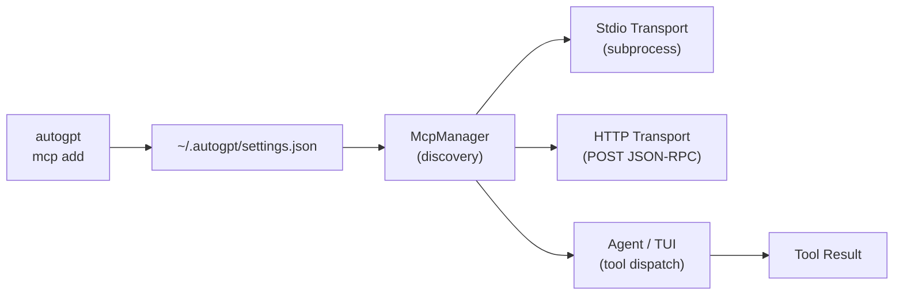

# 🔌 Model Context Protocol (MCP)

AutoGPT has first-class support for the **Model Context Protocol (MCP)**, a universal standard for connecting AI agents to external tools and data sources.

With MCP, you can extend your agents with any MCP-compatible server: filesystem access, database queries, web search, GitHub, Slack, custom APIs, and more.

## Requirements

Enable the `mcp` (and `cli`) feature flags when building:

```sh
cargo run --features "cli,mcp" --bin autogpt
```

Or install with all features:

```sh
cargo install autogpt --all-features
```

## What MCP Servers Can Do

Each MCP server exposes a set of **tools** the agent can discover and call:

- **Stdio servers**: Spawned as a child process; communicate over stdin/stdout.
- **HTTP servers**: Communicate over HTTP/POST with JSON-RPC.
- **SSE servers**: Server-Sent Events transport.

## Quick Overview

| Topic                                            | Page                          |
| ------------------------------------------------ | ----------------------------- |
| CLI: adding, listing, inspecting, removing       | [CLI Reference](./mcp-cli.md) |
| TUI: slash commands inside the interactive shell | [TUI Commands](./mcp-tui.md)  |
| Environment variables, `.env`, secrets           | [Secrets & Env](./mcp-env.md) |
| HTTP headers and auth                            | [Auth](./mcp-auth.md)         |
| SDK: programmatic API                            | [SDK Usage](./mcp-sdk.md)     |

## How It Works



1. You register servers via the CLI or TUI.
2. Settings are stored in `~/.autogpt/settings.json`.
3. On connect, the `McpManager` spawns/connects and runs `tools/list`.
4. Discovered tools are prefixed as `mcp_{server}_{tool}` to avoid collisions.
5. Agents or the TUI can call any tool via `mcp call`.

## The `settings.json` MCP Block

MCP server configurations live under the `mcp` key in `~/.autogpt/settings.json`:

```json
{
  "mcp": {
    "my-server": {
      "name": "my-server",
      "transport": "stdio",
      "command": "npx",
      "args": ["-y", "@modelcontextprotocol/server-everything"],
      "env": {
        "API_KEY": "$MY_API_TOKEN"
      },
      "headers": {},
      "timeout_ms": 30000,
      "trust": false,
      "include_tools": [],
      "exclude_tools": []
    }
  }
}
```

> **Never hard-code secrets.** Use `$VAR`, `${VAR}`, or `%VAR%` references in `env` and `headers` values. They are expanded at runtime from your shell environment or `.env` file. See [Secrets & Env](./mcp-env.md).

## Field Reference

| Field           | Type       | Default | Description                                                               |
| --------------- | ---------- | ------- | ------------------------------------------------------------------------- |
| `transport`     | `string`   | `stdio` | `stdio`, `http`, or `sse`                                                 |
| `command`       | `string`   | -       | Path or name of executable (stdio) or base URL (http/sse)                 |
| `args`          | `string[]` | `[]`    | Arguments passed to the executable (stdio only)                           |
| `env`           | `object`   | `{}`    | Environment variables; values support `$VAR`, `${VAR}`, `%VAR%`           |
| `headers`       | `object`   | `{}`    | HTTP headers for http/sse transports; values support env expansion        |
| `timeout_ms`    | `number`   | `30000` | Connection + request timeout in ms                                        |
| `trust`         | `bool`     | `false` | When `true`, skip all tool-call confirmations                             |
| `include_tools` | `string[]` | `[]`    | If non-empty, only these tools are exposed (allowlist)                    |
| `exclude_tools` | `string[]` | `[]`    | Tools to hide even if exposed by the server (blocklist, takes precedence) |
| `description`   | `string`   | `""`    | Human-readable label shown in `list` and `inspect`                        |

## Examples

### Public npm MCP server (stdio)

```sh
autogpt mcp add everything --command npx -- -y @modelcontextprotocol/server-everything
```

### Add a GitHub MCP server via Docker (Stdio)

```sh
autogpt mcp add github --transport stdio --command 'docker' --args 'run,-i,ghcr.io/modelcontextprotocol/servers/github:latest' --env 'GITHUB_TOKEN=$TOKEN'
```

### Add a search server via SSE

```sh
autogpt mcp add search --transport sse --url 'https://search.wiseai.dev/mcp/sse' --header 'Authorization: Bearer $MY_API_KEY'
```

> **Note:** Make sure your environment variables (e.g., `$TOKEN`, `$MY_API_KEY`) are exported in your shell before running these commands, as they are expanded by your shell before being passed to AutoGPT.

### Filtered tool exposure

```sh
autogpt mcp add secure-server \
  --command npx -- -y @modelcontextprotocol/server-everything \
  --include-tools echo,add \
  --exclude-tools get-env
```

## See Also

- [CLI Reference →](./mcp-cli.md)
- [TUI Commands →](./mcp-tui.md)
- [Secrets & Env →](./mcp-env.md)
- [Auth →](./mcp-auth.md)
- [SDK Usage →](./mcp-sdk.md)
