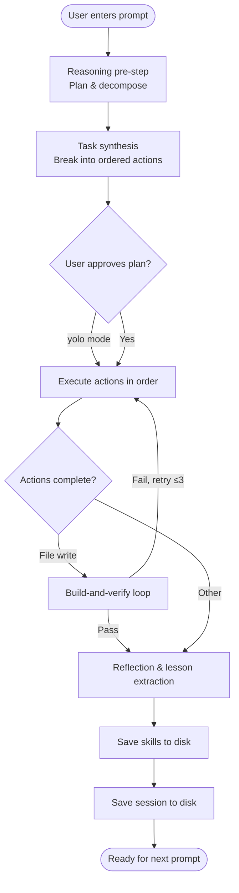

# GenericGPT

GenericGPT is the autonomous, self-improving software engineering agent that powers AutoGPT's default interactive shell. It is the **primary agent** a developer interacts with when running `autogpt` with no subcommands.

Unlike the specialised agents (BackendGPT, FrontendGPT, etc.) that each own a single discipline, GenericGPT is a **generalist**: it reasons about its task, decomposes it into steps, writes or edits files surgically, runs the project's build system, and learns from the outcome, all autonomously.

## Capabilities

| Capability             | Description                                                                               |
| ---------------------- | ----------------------------------------------------------------------------------------- |
| **Reasoning pre-step** | Plans before acting; emits a structured internal monologue before every task              |
| **File tooling**       | `CreateFile`, `WriteFile`, `PatchFile`, `ReadFile`, `AppendFile`, `ListDir`, `FindInFile` |
| **Shell execution**    | `RunCommand` runs arbitrary shell commands inside the workspace                           |
| **Build-and-verify**   | Detects the build system (`cargo`, `npm`, `python`, ...) and iterates on errors           |
| **Git commits**        | `GitCommit` action commits changes with a generated message                               |
| **Persistent skills**  | Learns lessons across sessions and injects them into future prompts                       |
| **Session continuity** | Full conversation history is restored when you resume a session                           |
| **Multi-provider**     | Switches between Gemini, OpenAI, Anthropic, xAI, Cohere, and HuggingFace at runtime       |

## The `.autogpt` Directory

GenericGPT maintains a hidden directory at its state root (typically `~/.autogpt/`, but controlled by the `AUTOGPT_WORKSPACE` environment variable) that stores all persistent state:

```
~/.autogpt/
├── sessions/          # Markdown conversation snapshots, auto-saved after every response
│   ├── <uuid>.md
│   └── ...
└── skills/                    # Learned lessons (TOML)
    ├── rust.toml
    ├── web.toml
    ├── python.toml
    └── ...
```

> **Working directory**: GenericGPT defaults its workspace to the **current directory** where the CLI is launched. Set `AUTOGPT_WORKSPACE` to override:
>
> ```sh
> export AUTOGPT_WORKSPACE=/my/project
> autogpt          # all file operations are scoped to /my/project
> ```

## Skills: Cross-Session Learning

After each task, GenericGPT extracts lessons and stores them in TOML skill files under `skills/`. The agent auto-detects the current project domain and injects only the relevant lessons into the system prompt for the next session, avoiding past mistakes automatically.

Skill files are plain TOML and can be inspected or edited:

```toml
# ~/.autogpt/skills/rust.toml
[[lessons]]
title = "Use PatchFile over WriteFile for edits"
detail = "Anchor-text patching is safer than full rewrites for large files."
added_at = "2026-05-06T14:50:00Z"
uses = 4
```

## Session Management

Sessions are stored as YAML files and indexed by UUID. Resume a past session from within the shell:

```
> /sessions
  1. "Implement a REST API in Rust using axum"   (8/10 tasks)   2026-05-06
  2. "Build a React dashboard with auth"          (3/5 tasks)    2026-05-05

> Enter number to resume: 1
✓ Resumed session - 8 tasks completed, 2 remaining.
```

## Build-and-Verify Loop

After writing code, GenericGPT detects the build system and runs it automatically:

| Build system | Detection signal                      | Command run            |
| ------------ | ------------------------------------- | ---------------------- |
| Cargo        | `Cargo.toml`                          | `cargo build`          |
| npm / Node   | `package.json`                        | `npm run build`        |
| Python       | `pyproject.toml` / `requirements.txt` | `python -m py_compile` |
| Make         | `Makefile`                            | `make`                 |

If the build fails, the error output is fed back into the agent's context and it attempts an automated fix, up to 3 times, before reporting the failure to you.

## Execution Flow



## Environment Variables

| Variable            | Default             | Description                            |
| ------------------- | ------------------- | -------------------------------------- |
| `AI_PROVIDER`       | `gemini`            | Active LLM provider                    |
| `AUTOGPT_WORKSPACE` | `.` (cwd)           | Workspace root where files are written |
| `GEMINI_MODEL`      | _(first in list)_   | Override the active Gemini model       |
| `OPENAI_MODEL`      | _(first in list)_   | Override the active OpenAI model       |
| `ANTHROPIC_MODEL`   | _(first in list)_   | Override the active Anthropic model    |
| `XAI_MODEL`         | _(first in list)_   | Override the active xAI model          |
| `COHERE_MODEL`      | _(first in list)_   | Override the active Cohere model       |
| `HF_MODEL`          | _(first in list)_   | Override the active HuggingFace model  |
| `MODEL`             | _(global fallback)_ | Global model override for any provider |

## Feature Flags

GenericGPT and the interactive shell require the `cli` feature plus at least one provider feature:

```sh
# Gemini (recommended)
cargo install autogpt --features cli,gem

# OpenAI
cargo install autogpt --features cli,oai

# All providers
cargo install autogpt --all-features
```
