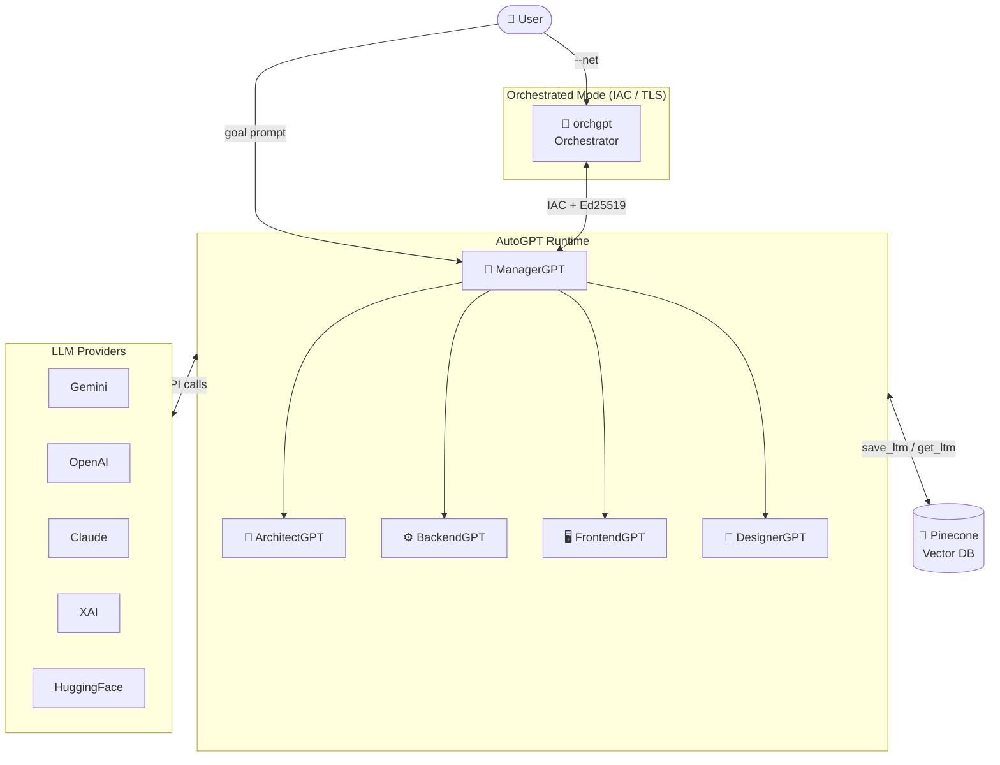

<div class="hero-banner">
<h1>🤖 AutoGPT</h1>
<p>A pure-Rust, multimodal, zero-shot, blazingly fast and infinitely composable AI agentic framework.</p>
</div>

AutoGPT is a **pure Rust framework** that makes building, deploying, and orchestrating intelligent AI agents as natural as writing idiomatic Rust code. It solves the hard problems of agentic AI so you can focus on what your agents actually do.

## What Problem Does AutoGPT Solve?

Building production-grade AI agents is painful. You need to wire up LLM API calls, manage conversation state, handle retries, persist long-term memory, coordinate multiple agents, secure inter-agent communication, and integrate version control, all before writing any business logic.

AutoGPT eliminates this boilerplate. Define a persona and a behavior. The framework handles everything else.

```rust
use autogpt::prelude::*;

#[tokio::main]
async fn main() {
    let agent = ArchitectGPT::new(
        "Lead UX/UI Designer",
        "Generate a Kubernetes architecture diagram with Prometheus monitoring.",
    ).await;

    AutoGPT::default()
        .with(agents![agent])
        .build()
        .expect("Failed to build AutoGPT")
        .run()
        .await
        .unwrap();
}
```

That is the entire program. AutoGPT initializes the LLM client, constructs the task, runs the agent asynchronously, and writes the output to the workspace.

## Core Capabilities

<div class="feature-grid">
<div class="feature-card">
<span class="icon">⚡</span>
<h3>Blazing Speed</h3>
<p>Written entirely in safe Rust with async/await and Tokio. Agents run concurrently with zero-cost abstractions.</p>
</div>
<div class="feature-card">
<span class="icon">🧩</span>
<h3>Composable Agents</h3>
<p>Mix built-in agents or bring your own via the <code>Auto</code> derive macro and <code>Executor</code> trait.</p>
</div>
<div class="feature-card">
<span class="icon">🌐</span>
<h3>Multi-Provider LLMs</h3>
<p>Gemini, OpenAI, Anthropic Claude, XAI Grok, Cohere, and HuggingFace, switch with a single env var.</p>
</div>
<div class="feature-card">
<span class="icon">🔒</span>
<h3>Secure Networking</h3>
<p>IAC protocol over QUIC/TLS with Ed25519 cryptographic agent identity for distributed deployments.</p>
</div>
<div class="feature-card">
<span class="icon">🧠</span>
<h3>Long-Term Memory</h3>
<p>Pinecone vector database integration to persist and recall agent knowledge across sessions.</p>
</div>
<div class="feature-card">
<span class="icon">🛠️</span>
<h3>9 Built-in Agents</h3>
<p>ManagerGPT, ArchitectGPT, BackendGPT, FrontendGPT, DesignerGPT, GitGPT, MailerGPT, OptimizerGPT, and GenericGPT.</p>
</div>
</div>

## Architecture at a Glance



## Operating Modes

| Mode              | Command                           | Description                                     |
| ----------------- | --------------------------------- | ----------------------------------------------- |
| Interactive Shell | `autogpt`                         | Conversational AI shell with session management |
| Direct Prompt     | `autogpt -p "..."`                | One-shot LLM query from the terminal            |
| Standalone Agent  | `autogpt arch` / `back` / `front` | Run a single specialized agent                  |
| Orchestrated      | `autogpt --net`                   | Networked multi-agent mode via IAC/TLS          |

## Quick Links

- **[Installation →](./getting-started/installation.md)**: Get AutoGPT running in minutes.
- **[Quickstart →](./getting-started/quickstart.md)**: Build your first agent.
- **[Custom Agents →](./sdk/custom-agents.md)**: Compose your own agent from scratch.
- **[IAC Protocol →](./advanced/iac-protocol.md)**: Understand the communication layer.
- **[GitHub](https://github.com/wiseaidotdev/autogpt)**: Source code and releases.

<div class="callout callout-info">
<strong>ℹ️ Note</strong>
AutoGPT is under active development. The <code>0.x</code> API is stabilizing. For the latest changes, follow the <a href="https://github.com/wiseaidotdev/autogpt/releases">GitHub releases</a>.
</div>
